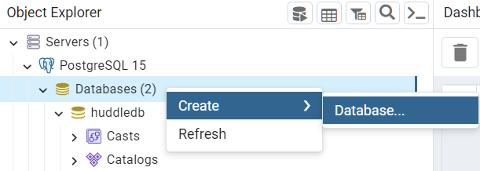
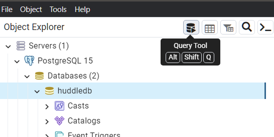
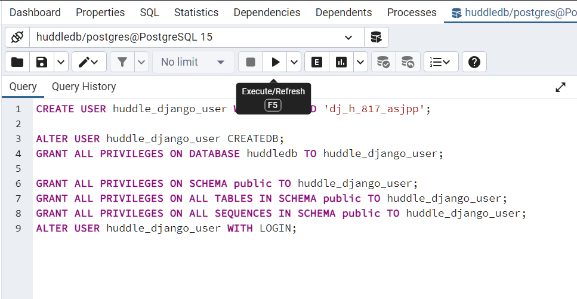

# BACKEND for HUDDLEARN

Draftly working, 
You can register new user, login
Work with JWT tokens

You can use GET POST PATCH, to list, add and modify this entities
1. skills
2. studygroups
3. projectgroups
4. huddleusers

Complete CRUD endpoints, JSON:
/skills/
/studygroups/
/projectgroups/
/huddleusers/

(See huddleapi/models.py for fields names)

Additional:
JSON: { "user_id": <HuddleUserID> }
/studygroups/<GroupID>/add_member/
/studygroups/<GroupID>/remove_member/
/projectgroups/<GroupID>/add_member/
/projectgroups/<GroupID>/remove_member/


There is a also HUDDLE.postman_collection.json for POSTMAN working
You can use it


# Installation Notes

Back-end works on Python 10 + Django + Django REST freamwork + Postgre SQL 15


## Download and run [PostgreSQL 15](https://www.enterprisedb.com/downloads/postgres-postgresql-downloads) installer version 15.5 
Use default setting, adress: localhost and port 5432. Remember your superuser name (postgres) and password.
After install run "pgAdmin 4" from the package, login with password. Expand from drop-down Servers>PostgreSQL>Databases
With right click open menu and select Create Database



Make the database named ```huddledb``` 
Then click on the new database name, and click Query.



in SQL query window insert this text and run:
```
CREATE USER huddle_django_user WITH PASSWORD 'dj_h_817_asjpp';

ALTER USER huddle_django_user CREATEDB;
GRANT ALL PRIVILEGES ON DATABASE huddledb TO huddle_django_user;

GRANT ALL PRIVILEGES ON SCHEMA public TO huddle_django_user;
GRANT ALL PRIVILEGES ON ALL TABLES IN SCHEMA public TO huddle_django_user;
GRANT ALL PRIVILEGES ON ALL SEQUENCES IN SCHEMA public TO huddle_django_user;
ALTER USER huddle_django_user WITH LOGIN;

```




## Install aLL modules 

You should have Python installed. naviate to the ```server``` folder with pipfile and pipfile.lock files
run
```
pip install pipenv
pipenv install
```
And run this to enter virtual environment, and navigate to server directory:
```
pipenv shell
```


(ALTERNATIVE) If you don't want to use pipenv, just make the venv and install all with pip
```
python -m venv venv

pip install django
pip install djangorestframework
pip install djangorestframework-jwt
```

And run this to enter virtual environment:
```
venv\Scripts\activate

```


## Initialize the database with migrations and make a Django superuser

In the shell of virtual environment run:
```
cd huddlearn
python manage.py createsuperuser --username=admin
```
Enter required email and password

Run this to prepare the project
``` 
python manage.py makemigrations
python manage.py migrate
```
Run Django console 
```
python manage.py shell
```
In python django console run this (it will create a connected HuddleUser instance for our admin)

```
import huddleapi.models
from django.contrib.auth.models import User
adm_user = User.objects.get(username="admin")
huddladmin=huddleapi.models.HuddleUser.objects.create(user=adm_user, fullname='Admin Adminovitch')
exit()
```

Run server
```
python manage.py runserver

```

Have fun


# TODO

1. add skills additions

2. PICTURES! 

3. in the add users check if user is not in group
4. remove user - check if user creator - prohibit
    if user in coordinators - remove from there

5. in the future it may requre a lots of stuff
